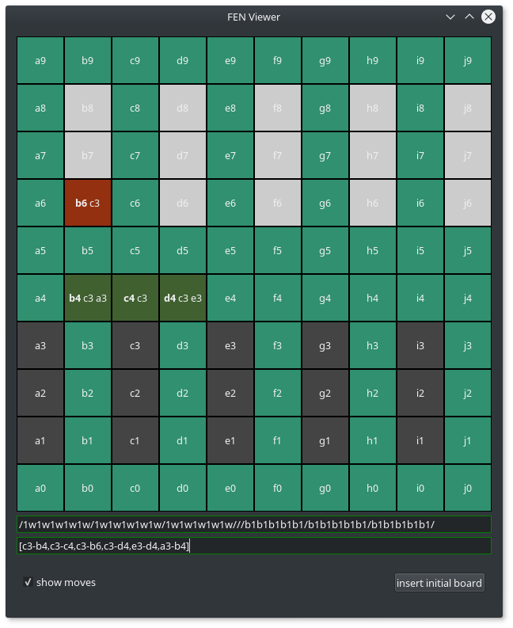

### FenViewer illustrates a given fen string on a board
**This tool does not check for a correct move. It just displays your entered move string...**
The **bold** labels are the actual fields. Next to them are the fields from which the figure is coming from.
Colors:
- orange/red indicates a hit (any hit from b **OR** w)
- light green is the board color
- dark green is a possible move from b **OR** w onto a neutral field
- white is a town
- black is a town
- light grey is a white soldier
- dark grey is a black soldier

*c3-b6 is not a correct move ... BUT in this case it demonstrates a hit*
### Installation
works with python3.6 and probably every python3.x version.
- The only dependency is PyQt5. Install it via `pip3 install PyQt5` or using your prefered pip version
- requirements.txt can be found within the repo

### Bugs
- ~~The visualisation of the haskell move string isn't yet fully implement and only works roughly.~~
- ~~To reset a fully processed move string (every move is on the board) write something into the lineedit to refresh.~~ 
	(the ability to visualize every single move has been removed)

*no guarantee for a fully correct working FEN check or MOVE LIST check*
